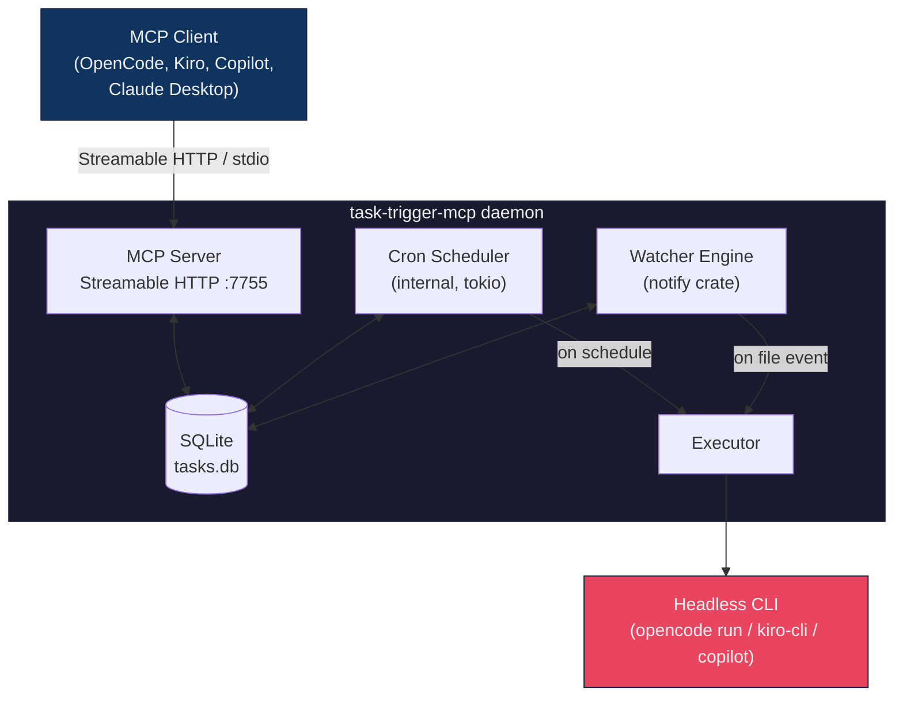

# task-trigger-mcp

[](https://github.com/JheisonMB/task-trigger-mcp/actions/workflows/ci.yml)
[](https://github.com/JheisonMB/task-trigger-mcp/actions/workflows/release.yml)
[](https://crates.io/crates/task-trigger-mcp)
[](LICENSE)

A self-contained MCP server that lets AI agents register, manage, and execute **scheduled** and **event-driven** tasks. Single static binary. No runtime dependencies. Cross-platform (Linux/WSL, macOS).

Your agent says *"run tests every day at 9am"* — the model converts that to a cron expression, and the binary handles scheduling, file watching, CLI invocation, log rotation, and everything else internally. The agent never writes bash scripts or touches crontab.

---

## How It Works



**Key property**: the agent connects and disconnects freely. Watchers keep running. Scheduled tasks keep firing. The daemon is the source of truth.

---

## Installation

### Quick install (recommended)

```bash
curl -fsSL https://raw.githubusercontent.com/JheisonMB/task-trigger-mcp/main/install.sh | sh
```

This downloads the latest prebuilt binary for your platform and installs it to `~/.local/bin`. No Rust toolchain needed.

You can customize the install:

```bash
# Pin a specific version
VERSION=1.0.0 curl -fsSL https://raw.githubusercontent.com/JheisonMB/task-trigger-mcp/main/install.sh | sh

# Install to a custom directory
INSTALL_DIR=/usr/local/bin curl -fsSL https://raw.githubusercontent.com/JheisonMB/task-trigger-mcp/main/install.sh | sh
```

### Via cargo

```bash
cargo install task-trigger-mcp
```

Available on [crates.io](https://crates.io/crates/task-trigger-mcp).

### From source

```bash
git clone https://github.com/JheisonMB/task-trigger-mcp.git
cd task-trigger-mcp
cargo build --release
# Binary at target/release/task-trigger-mcp
```

### GitHub Releases

Check the [Releases](https://github.com/JheisonMB/task-trigger-mcp/releases) page for precompiled binaries (Linux x86_64, macOS x86_64/ARM64, Windows x86_64).

---

## MCP Client Configuration

Add this to your OpenCode config file (`~/.opencode/config.json`):

```json
{
  "mcp": {
    "task-trigger": {
      "type": "local",
      "command": ["task-trigger-mcp"],
      "args": ["stdio"],
      "enabled": true
    }
  }
}
```

**Note:** This runs task-trigger-mcp in stdio mode. Scheduled tasks will pause when OpenCode disconnects. For persistent task execution, run the daemon separately:

```bash
task-trigger-mcp daemon start
```

And reconfigure to use remote MCP:

```json
{
  "mcp": {
    "task-trigger": {
      "type": "remote",
      "url": "http://localhost:7755/mcp",
      "enabled": true
    }
  }
}
```

---

## Quick Start

```bash
# 1. Start the daemon
task-trigger-mcp daemon start

# 2. Check it's running
task-trigger-mcp daemon status

# 3. Your agent now has access to 12 task management tools
```

The daemon is a single long-running process that owns:

1. **MCP Server** (Streamable HTTP on port 7755) — so agents can connect and call tools
2. **Internal Cron Scheduler** (tokio) — event-driven, sleeps until the next task is due and executes it
3. **File Watcher Engine** (notify crate) — monitors files/directories for changes and triggers executions
4. **SQLite Database** — persists all task/watcher definitions, run history, and logs

There is no dependency on `crontab`, `launchd`, or any OS scheduler. Everything runs inside the daemon.

### What happens when the daemon stops?

| Component | Behavior |
|---|---|
| **Scheduled tasks** | Stop executing. They resume when the daemon restarts. |
| **File watchers** | Stop monitoring. They are reloaded from SQLite on restart. |
| **Task definitions** | Persist in SQLite. Nothing is lost. |

### How to make it survive reboots

```bash
task-trigger-mcp daemon install-service
```

This installs the daemon as a system service that starts automatically on boot:

- **Linux/WSL**: creates a systemd user unit and enables lingering (runs without active login)
- **macOS**: creates a launchd agent that starts on login

To remove the service:

```bash
task-trigger-mcp daemon uninstall-service
```

Alternatively, add `task-trigger-mcp daemon start` to your shell startup file (`.bashrc`, `.zshrc`).

---

## MCP Tools

The server exposes 12 tools to the agent:

| Tool | Description |
|---|---|
| `task_add` | Register a scheduled task with a 5-field cron expression (`*/5 * * * *`, `0 9 * * 1-5`). Supports `timeout_minutes` for execution locking. |
| `task_watch` | Watch a file/directory for create, modify, delete, or move events. Supports `timeout_minutes` for execution locking. |
| `task_report` | Report execution status from a running task. Called by the agent with `run_id`, `status` (`in_progress`, `success`, `error`), and `summary`. |
| `task_update` | Modify an existing task or watcher (schedule, prompt, events, etc.) without deleting and recreating it |
| `task_list` | List all scheduled tasks with status, last run, and expiry info |
| `task_watchers` | List all file watchers with status and trigger counts |
| `task_remove` | Remove a task or watcher completely |
| `task_unwatch` | Pause a file watcher without deleting it |
| `task_enable` | Re-enable a disabled task or watcher |
| `task_disable` | Disable a task or watcher without removing it |
| `task_run` | Execute a task immediately, outside its schedule |
| `task_logs` | Get log output for a task or watcher with optional line/time filters |
| `task_status` | Daemon health: uptime, transport, scheduler status, active counts |

### Schedule format (cron)

The `schedule` field in `task_add` expects a standard 5-field cron expression:

```
┌───────── minute (0-59)
│ ┌─────── hour (0-23)
│ │ ┌───── day of month (1-31)
│ │ │ ┌─── month (1-12)
│ │ │ │ ┌─ day of week (0-6, 0=Sun)
│ │ │ │ │
* * * * *
```

Common patterns:
- `*/5 * * * *` — every 5 minutes
- `0 9 * * *` — daily at 9am
- `0 9 * * 1-5` — weekdays at 9am
- `0 */2 * * *` — every 2 hours
- `30 14 1,15 * *` — 1st and 15th at 2:30pm

The model is responsible for converting natural language (e.g. "every day at 9am") into cron expressions. The tool description includes common patterns to guide the model.

### Execution runs & locking

Every task execution generates a unique run (UUID) with a lifecycle:

```
pending → in_progress → success / error
                      → timeout (if agent doesn't report back)
```

**How it works:**

1. When the daemon launches a task, it creates a run with status `pending` and locks the task
2. The prompt sent to the agent includes instructions to call `task_report` with the `run_id`
3. The agent calls `task_report(run_id, "in_progress")` immediately, then does its work
4. When finished, the agent calls `task_report(run_id, "success", summary)` or `task_report(run_id, "error", summary)`
5. If a new trigger arrives while the task is locked, it's recorded as `missed` and skipped

**Timeout:** Each task has a configurable `timeout_minutes` (default: 15). If the agent doesn't report back within this window, the run is marked as `timeout` and the task is unlocked on the next trigger. This prevents tasks from being permanently locked.

**Anti-recursion for watchers:** The locking mechanism naturally prevents recursive loops — if a watcher triggers a CLI that modifies the watched file, the second trigger is skipped because the task is still locked.

---

## Usage Examples

### Schedule a daily test run

> Agent: "Run the test suite every day at 9am"

The model calls `task_add`:
```json
{
  "id": "daily-tests",
  "prompt": "Run cargo test in the project and report any failures",
  "schedule": "0 9 * * *",
  "cli": "opencode",
  "working_dir": "/home/user/my-project",
  "timeout_minutes": 30
}
```

### Watch for source changes

> Agent: "Watch src/ for changes and run the linter"

The model calls `task_watch`:
```json
{
  "id": "lint-on-change",
  "path": "/home/user/my-project/src",
  "events": ["create", "modify"],
  "prompt": "Run cargo clippy and fix any warnings",
  "cli": "opencode",
  "recursive": true,
  "debounce_seconds": 5
}
```

### Temporary task with auto-expiry

> Agent: "Check deployment status every minute for the next hour"

```json
{
  "id": "monitor-deploy",
  "prompt": "Check deployment status and report",
  "schedule": "*/1 * * * *",
  "cli": "opencode",
  "duration_minutes": 60
}
```

This task auto-disables after 60 minutes.

### Prompt variables

Prompts support variable substitution at execution time:

- `{{TIMESTAMP}}` — current ISO 8601 timestamp
- `{{TASK_ID}}` — the task's ID
- `{{LOG_PATH}}` — path to the task's log file
- `{{FILE_PATH}}` — the watched file path (watchers only)
- `{{EVENT_TYPE}}` — the event that fired (watchers only)

---

## Daemon Management

```bash
task-trigger-mcp daemon start              # start in background
task-trigger-mcp daemon stop               # stop daemon
task-trigger-mcp daemon status             # check if running
task-trigger-mcp daemon restart            # restart
task-trigger-mcp daemon logs               # tail daemon logs
task-trigger-mcp daemon install-service    # install as systemd/launchd service
task-trigger-mcp daemon uninstall-service  # remove the system service
```

---

## Runtime Directory

```
~/.task-trigger/
  tasks.db              # SQLite database
  daemon.pid            # PID file for daemon management
  daemon.log            # daemon-level logs
  logs/
    <task-id>.log       # per-task/watcher logs (5MB rotation)
```

---

## Platform Support

| Feature | Linux / WSL | macOS |
|---|---|---|
| Daemon transport | Streamable HTTP localhost | Streamable HTTP localhost |
| Cron scheduling | Internal (tokio) | Internal (tokio) |
| File watching | inotify | FSEvents |
| Service install | systemd user unit | launchd agent |
| Binary format | ELF static (musl) | Mach-O |

---

## Tech Stack

| Concern | Crate |
|---|---|
| MCP SDK | `rmcp` + `rmcp-macros` |
| Async runtime | `tokio` |
| HTTP transport | `axum` |
| Cron parsing | `cron` |
| File watching | `notify` |
| State | `rusqlite` (bundled) |
| Serialization | `serde` + `serde_json` |
| CLI detection | `which` |
| UUID generation | `uuid` |
| Logging | `tracing` |

---

## License

MIT
