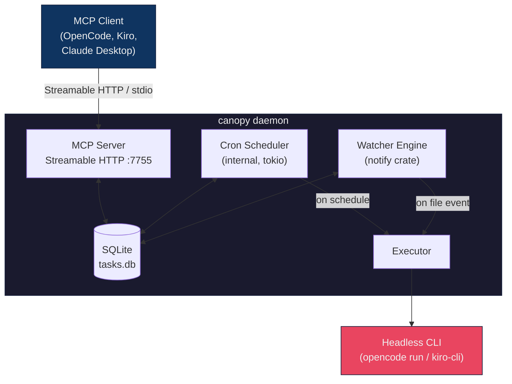

# agent-canopy

<p align="center">
  <a href="https://github.com/UniverLab/agent-canopy/actions/workflows/ci.yml"></a>
  <a href="https://crates.io/crates/agent-canopy"></a>
  
  <a href="LICENSE"></a>
</p>

A self-contained MCP server that lets AI agents register, manage, and execute scheduled and event-driven tasks. Single static binary. No runtime dependencies. Cross-platform (Linux/WSL, macOS, Windows).

> **Note:** The crate is published as `agent-canopy` on crates.io. The CLI binary is invoked as `canopy`.
>
> This project was previously published as [`task-trigger-mcp`](https://crates.io/crates/task-trigger-mcp), which is now deprecated in favor of this package.

---


## How It Works



The agent connects and disconnects freely. Watchers keep running. Scheduled tasks keep firing. The daemon is the source of truth.

---

## Installation

### Quick install (recommended)

**Linux / macOS:**

```bash
curl -fsSL https://raw.githubusercontent.com/UniverLab/agent-canopy/main/scripts/install.sh | sh
```

**Windows (PowerShell):**

```powershell
irm https://raw.githubusercontent.com/UniverLab/agent-canopy/main/scripts/install.ps1 | iex
```

This downloads and installs `canopy`. No Rust toolchain required.

You can customize the install:

```bash
# Pin a specific version
VERSION=2.0.0 curl -fsSL https://raw.githubusercontent.com/UniverLab/agent-canopy/main/scripts/install.sh | sh

# Install to a custom directory
INSTALL_DIR=/usr/local/bin curl -fsSL https://raw.githubusercontent.com/UniverLab/agent-canopy/main/scripts/install.sh | sh
```

### Via cargo

```bash
cargo install agent-canopy
```

Available on [crates.io](https://crates.io/crates/agent-canopy).

### From source

```bash
git clone https://github.com/UniverLab/agent-canopy.git
cd agent-canopy
cargo build --release
# Binary at target/release/canopy
```

### GitHub Releases

Check the [Releases](https://github.com/UniverLab/agent-canopy/releases) page for precompiled binaries (Linux x86_64, macOS x86_64/ARM64, Windows x86_64).

### Uninstall

```bash
rm -f ~/.local/bin/canopy
rm -rf ~/.canopy/
```

---

## MCP Client Configuration

Add this to your OpenCode config file (`~/.opencode/config.json`):

```json
{
  "mcp": {
    "canopy": {
      "type": "local",
      "command": ["canopy"],
      "args": ["stdio"],
      "enabled": true
    }
  }
}
```

For persistent task execution, run the daemon separately:

```bash
canopy daemon start
```

And reconfigure to use remote MCP:

```json
{
  "mcp": {
    "canopy": {
      "type": "remote",
      "url": "http://localhost:7755/mcp",
      "enabled": true
    }
  }
}
```

---

## Quick Start

```bash
# 1. Start the daemon
canopy daemon start

# 2. Check it's running
canopy daemon status

# 3. Your agent now has access to 12 task management tools
```

The daemon is a single long-running process that owns:

1. **MCP Server** (Streamable HTTP on port 7755)
2. **Internal Cron Scheduler** (tokio) — event-driven, sleeps until the next task is due
3. **File Watcher Engine** (notify crate) — monitors files/directories for changes
4. **SQLite Database** — persists all task/watcher definitions, run history, and logs

No dependency on `crontab`, `launchd`, or any OS scheduler.

### Daemon lifecycle

| Component | When daemon stops | When daemon restarts |
|---|---|---|
| Scheduled tasks | Stop executing | Resume automatically |
| File watchers | Stop monitoring | Reloaded from SQLite |
| Task definitions | Persist in SQLite | Nothing is lost |

### Survive reboots

```bash
canopy daemon install-service
```

- **Linux/WSL**: systemd user unit with lingering
- **macOS**: launchd agent

```bash
canopy daemon uninstall-service
```

---

## MCP Tools

The server exposes 12 tools to the agent:

| Tool | Description |
|---|---|
| `task_add` | Register a scheduled task with a 5-field cron expression |
| `task_watch` | Watch a file/directory for create, modify, delete, or move events |
| `task_report` | Report execution status from a running task |
| `task_update` | Modify an existing task or watcher without recreating it |
| `task_list` | List all scheduled tasks with status and last run |
| `task_watchers` | List all file watchers with status and trigger counts |
| `task_remove` | Remove a task or watcher completely |
| `task_unwatch` | Pause a file watcher without deleting it |
| `task_enable` | Re-enable a disabled task or watcher |
| `task_disable` | Disable a task or watcher without removing it |
| `task_run` | Execute a task immediately, outside its schedule |
| `task_logs` | Get log output with optional line/time filters |
| `task_status` | Daemon health: uptime, transport, scheduler status |

### Schedule format (cron)

```
┌───────── minute (0-59)
│ ┌─────── hour (0-23)
│ │ ┌───── day of month (1-31)
│ │ │ ┌─── month (1-12)
│ │ │ │ ┌─ day of week (0-6, 0=Sun)
│ │ │ │ │
* * * * *
```

Common patterns: `*/5 * * * *` (every 5 min), `0 9 * * *` (daily 9am), `0 9 * * 1-5` (weekdays 9am).

### Execution runs & locking

Every execution generates a unique run (UUID):

```
pending → in_progress → success / error
                      → timeout (if agent doesn't report back)
```

Configurable `timeout_minutes` (default: 15). Anti-recursion for watchers via locking.

### Prompt variables

- `{{TIMESTAMP}}` — current ISO 8601 timestamp
- `{{TASK_ID}}` — the task's ID
- `{{LOG_PATH}}` — path to the task's log file
- `{{FILE_PATH}}` — watched file path (watchers only)
- `{{EVENT_TYPE}}` — event that fired (watchers only)

---

## Usage Examples

### Schedule a daily test run

```json
{
  "id": "daily-tests",
  "prompt": "Run cargo test in the project and report any failures",
  "schedule": "0 9 * * *",
  "cli": "opencode",
  "working_dir": "/home/user/my-project",
  "timeout_minutes": 30
}
```

### Watch for source changes

```json
{
  "id": "lint-on-change",
  "path": "/home/user/my-project/src",
  "events": ["create", "modify"],
  "prompt": "Run cargo clippy and fix any warnings",
  "cli": "opencode",
  "recursive": true,
  "debounce_seconds": 5
}
```

### Temporary task with auto-expiry

```json
{
  "id": "monitor-deploy",
  "prompt": "Check deployment status and report",
  "schedule": "*/1 * * * *",
  "cli": "opencode",
  "duration_minutes": 60
}
```

---

## Daemon Management

```bash
canopy daemon start              # start in background
canopy daemon stop               # stop daemon
canopy daemon status             # check if running
canopy daemon restart            # restart
canopy daemon logs               # tail daemon logs
canopy daemon install-service    # install as system service
canopy daemon uninstall-service  # remove the system service
```

---

## Runtime Directory

```
~/.canopy/
  tasks.db              # SQLite database
  daemon.pid            # PID file
  daemon.log            # daemon-level logs
  logs/
    <task-id>.log       # per-task/watcher logs (5MB rotation)
```

---

## Platform Support

| Feature | Linux / WSL | macOS | Windows |
|---|---|---|---|
| Daemon transport | Streamable HTTP | Streamable HTTP | Streamable HTTP |
| Cron scheduling | Internal (tokio) | Internal (tokio) | Internal (tokio) |
| File watching | inotify | FSEvents | ReadDirectoryChanges |
| Service install | systemd user unit | launchd agent | — |
| Binary format | ELF static (musl) | Mach-O | PE |

---

## Tech Stack

| Concern | Crate |
|---|---|
| MCP SDK | `rmcp` + `rmcp-macros` |
| Async runtime | `tokio` |
| HTTP transport | `axum` |
| Cron parsing | `cron` |
| File watching | `notify` |
| State | `rusqlite` (bundled) |
| Serialization | `serde` + `serde_json` |
| CLI | `clap` |
| Logging | `tracing` |

---

## License

MIT — see [LICENSE](LICENSE) for details.

---

Made with ❤️ by [JheisonMB](https://github.com/JheisonMB) and [UniverLab](https://github.com/UniverLab) 
